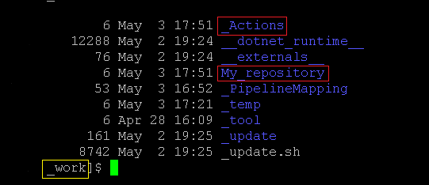
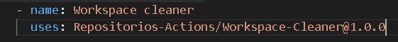
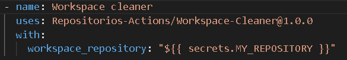

# Workspace cleaner

Actions para limpiar el los archivos alojados por el checkout del repositorio y la utilización de Actions en el runner.

## ¿Que es Workspace cleaner?

Workspace cleaner es un action que permite la eliminación de los archivos alojados en el runner especficamente en 2 directorios.

- My_Repository
- _Actions

  

IMPORTANTE: Este actions requiere definir un parametro de entrada que seria el nombre del repositorio que deseas eliminar.

## Instrucciones

1. Copiar el llamado del action en el maketplace de GitHub. Recomendamos usar siempre la ultima versión.

Ejemplo:

  

2. Pega en tu workflow y añade la etiqueta with: añadiendo el parametro workspace_repository: .

Ejemplo:

  

Se debe indicar el valor que corresponde. Nota: se puedes colocar los valores directos otra forma de trabajar es variabilizar los valores.

Ejemplo 2:

  

## Ejecución por consola

- rm -rf _actions
- rm -rf my_repository